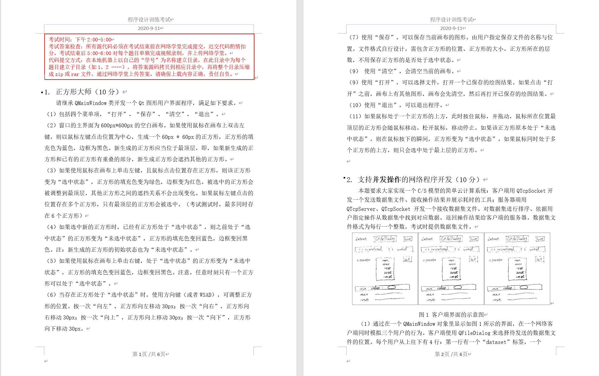
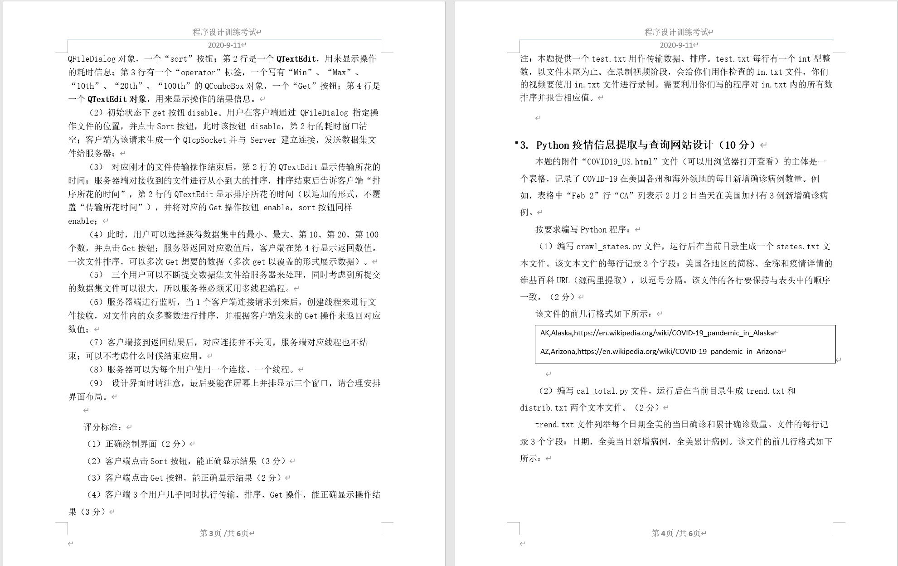
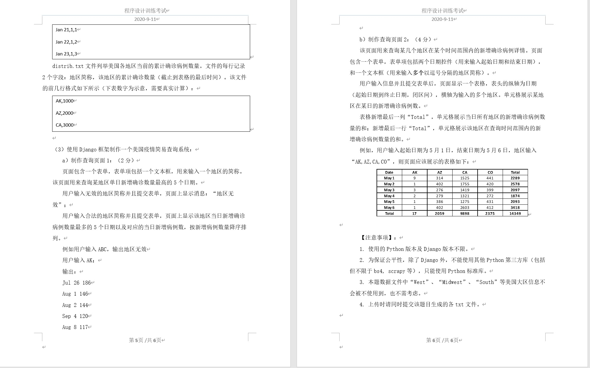
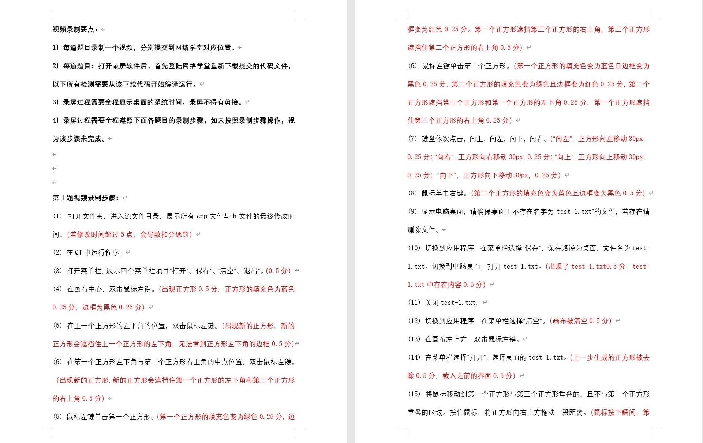
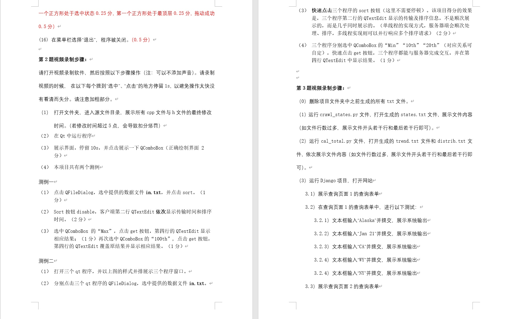
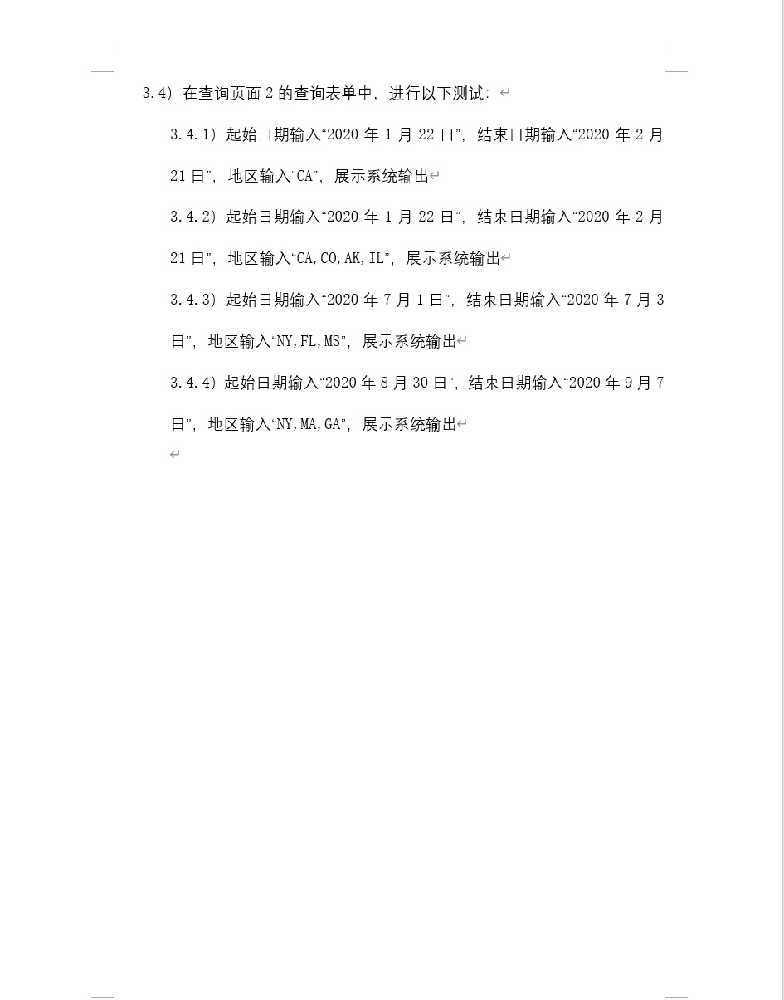

# tsinghua-cs-first-year-exam-20200911
[清华计算机系大一下学期考试大题](https://www.zhihu.com/question/420606617/answer/1479744962)

## 工程设计

**代码规范**

使用标准 Qt 风格。

**代码风格**

代码组织结构进行适度封装

设计风格 [设计Qt风格的C++API](https://www.cnblogs.com/findumars/p/11172622.html)([Design Qt Style C++ APIs](https://doc.qt.io/archives/qq/qq13-apis.html)) 和 [Google 开源项目风格指南](https://zh-google-styleguide.readthedocs.io/en/latest/google-cpp-styleguide/contents/)。

不滥用设计模式作过度抽象。

**代码注释**

使用中文进行适当注释，为考虑跨平台兼容性，使用 UTF-8 BOM 文件编码。

**工具版本**

基于 Qt 5 和 C++11 编写。

**版本管理**

每个题目，按照功能完成度和技术深度分为1-5个不同等级的分支。

提交记录中，会保证每次提交都是完整的一次开发过程，如完成主界面编写，并确保可以编译通过。

完成低等级的分支后，从中进行`branch`衍生高等级分支。

多个分支使用`submodule`的形式组织到`master`的目录结构中。

## 题目描述

